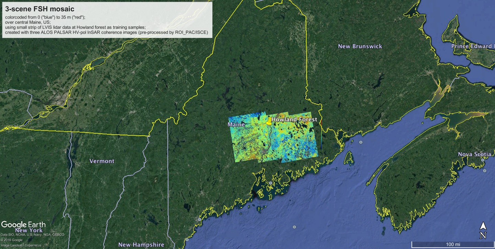

# Forest Stand Height (FSH) Python Scripts
Produced by the University of Massachusetts Microwave Remote Sensing Laboratory. 

113 Knowles Engineering Building, University of Massachusetts at Amherst, Amherst, MA, USA 01003.

Yang Lei, (ylei@caltech.edu, leiyangfrancis@gmail.com), Paul Siqueira (siqueira@ecs.umass.edu).

The Python 2 version of the scripts were updated to Python 3:
- Thannarot Kunlamai (SERVIR-Mekong, Asian Disaster Preparedness Center)
- Tim Mayer (timothy.j.mayer@nasa.gov, tjm0042@uah.edu)
- Helen Baldwin (helen.b.baldwin@nasa.gov, hbb0009@uah.edu)
- Simon Kraatz (skraatz@umass.edu)

***Besides contacting the authors via email for technical questions, it is also recommended to [refer to the closed issues or open a new issue on GitHub](https://github.com/leiyangleon/FSH/issues).***

===================================================================================

## Table of Contents:

### I. Required software packages and installation (https://github.com/sgk0/FSH/blob/master/installation.md)

### II. How to run FSH (https://github.com/sgk0/FSH/blob/master/how_to_run.md). 

- Please note that users will have to be able to generate their own interferograms. FSH was tested using PALSAR interferograms generated by ROIPAC and ISCE (up to v 2.2 use the insarApp.py workflow; 2.3+, use the stripmapApp.py workflow) software. Hence we provide three test_example folders ('test_example_ISCE_insarApp', 'test_example_ISCE_stripmapApp', 'test_example_ROIPAC'). Each folder contains a text file starting with 'NOTES_' describing how to obtain the example interferograms to be used to test this software installation. ***We recommend that the ISCE stripmapApp.py workflow is used, as the other options have been deprecated and are not actively supported***.

- Information and tutorials regarding ISCE and interferogram processing can be found at http://earthdef.caltech.edu/projects/isce_forum/boards. To those interested in pursuing their own interferogram processing, we used modified ISCE scripts which are provided with the FSH software, and described here: https://github.com/sgk0/FSH/blob/master/isce_preprocessing.md

### III. List of python files and corresponding descriptions (https://github.com/sgk0/FSH/blob/master/reference.md)

===================================================================================

## Citation:
[Lei, Y., Siqueira, P., Torbick, N., Ducey, M., Chowdhury, D. and Salas, W., 2019. Generation of Large-Scale Moderate-Resolution Forest Height Mosaic With Spaceborne Repeat-Pass SAR Interferometry and Lidar. IEEE Transactions on Geoscience and Remote Sensing, 57(2), pp.770-787.](https://ieeexplore.ieee.org/document/8439086)

## Related publications and book chapters:
1. Lei, Y. and Siqueira, P., 2014. [Estimation of forest height using spaceborne repeat-pass L-Band InSAR correlation magnitude over the US State of Maine](https://www.mdpi.com/2072-4292/6/11/10252). Remote Sensing, 6(11), pp.10252-10285.

2. Lei, Y. and Siqueira, P., 2015. [An automatic mosaicking algorithm for the generation of a large-scale forest height map using spaceborne repeat-pass InSAR correlation magnitude](https://www.mdpi.com/2072-4292/7/5/5639). Remote Sensing, 7(5), pp.5639-5659.

3. (**RECENT**) Lei, Y., Siqueira, P., Torbick, N., Ducey, M., Chowdhury, D. and Salas, W., 2019. [Generation of Large-Scale Moderate-Resolution Forest Height Mosaic With Spaceborne Repeat-Pass SAR Interferometry and Lidar](https://ieeexplore.ieee.org/document/8439086). IEEE Transactions on Geoscience and Remote Sensing, 57(2), pp.770-787.

4. The scripts have been updated to Python 3 as part of a workshop supporting [Chapter 4](https://gis1.servirglobal.net/TrainingMaterials/SAR/Chp4.pdf) (with [tutorial](https://gis1.servirglobal.net/TrainingMaterials/SAR/Chp4_appendixC.pdf)) of the [SAR Handbook](https://servirglobal.net/Global/Articles/Article/2674/sar-handbook-comprehensive-methodologies-for-forest-monitoring-and-biomass-estimation). [Flores-Anderson, Africa Ixmucane, Herndon, Kelsey E., Thapa, Rajesh Bahadur, and Cherrington, Emil, eds. SAR Handbook: Comprehensive Methodologies for Forest Monitoring and Biomass Estimation (Huntsville, AL: SERVIR GLobal Science Coordination Office, 2019). DOI: 10.25966/nr2c-s697.](https://servirglobal.net/Global/Articles/Article/2674/sar-handbook-comprehensive-methodologies-for-forest-monitoring-and-biomass-estimation)

  
## License:

Forest Stand Height (FSH) Python Scripts. This software performs the automated forest height inversion and mosaicking from spaceborne repeat-pass L-band HV-pol InSAR correlation magnitude data (e.g. JAXA’s ALOS-1/2, and the future NASA-ISRO’s NISAR) that have been pre-processed by JPL’s ROI_PAC and/or ISCE programs.

Copyright (C) 2017  Yang Lei, Paul Siqueira, Tracy Whelen.

This program is free software: you can redistribute it and/or modify it under the terms of the GNU General Public License as published by the Free Software Foundation, either version 3 of the License, or (at your option) any later version. 

This program is distributed in the hope that it will be useful, but WITHOUT ANY WARRANTY; without even the implied warranty of MERCHANTABILITY or FITNESS FOR A PARTICULAR PURPOSE. See the GNU General Public License for more details. 

You should have received a copy of the GNU General Public License along with this program.  If not, see <http://www.gnu.org/licenses/>.
